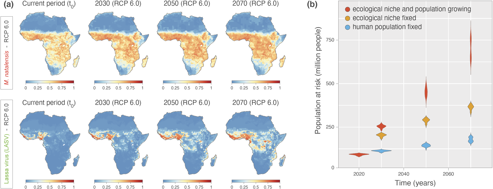

This repo gathers the input files and scripts related to our study entitled "**Predicting the evolution of the Lassa virus endemic area and population at risk over the next decades**" ([Klitting *et al*. 2022](https://www.nature.com/articles/s41467-022-33112-3), *Nature Communications*). R scripts related to the analyses are all gathered within the file `LASV_R_script_28042021.r`.

Abstract: Lassa fever is a severe viral hemorrhagic fever caused by a zoonotic virus that repeatedly spills over to humans from its rodent reservoirs. It is currently not known how climate and land use changes could affect the endemic area of this virus, currently limited to parts of West Africa. By exploring the environmental data associated with virus occurrence using ecological niche modelling, we show how temperature, precipitation and the presence of pastures determine ecological suitability for virus circulation. Based on projections of climate, land use, and population changes, we find that regions in Central and East Africa will likely become suitable for Lassa virus over the next decades and estimate that the total population living in ecological conditions that are suitable for Lassa virus circulation may drastically increase by 2070. By analysing geotagged viral genomes using spatially-explicit phylogeography and simulating virus dispersal, we find that in the event of Lassa virus being introduced into a new suitable region, its spread might remain spatially limited over the first decades.

**Figure: projected ecological niche suitability of Mastomys natalensis and Lassa virus, as well as human population at risk of exposure to Lassa virus.** **(a)** Projected ecological niche suitability of Mastomys natalensis (M. natalensis) and Lassa virus for the current period, 2030, 2050, and 2070. Each future projection (i.e., for 2030, 2050, and 2070) was performed according to four different bias-adjusted global climate models and three different representative concentration pathways (RCPs), i.e., greenhouse gas concentration scenarios considered by the Intergovernmental Panel on Climate Change (IPCC): RCP 2.6, RCP 6.0, and RCP 8.5. Here, we only report the projections obtained under RCP 6.0 (see Fig. S1 for the other scenarios as well as for the standard deviations associated with all projections, and see Fig. S2 for explicit differences between current and future projections). For a specific time period, we report ecological niche suitability averaged over the projections obtained with the four different climatic models (see the text for further detail). **(b)** Projections of the human population at risk of exposure to Lassa virus for the current period, 2030, 2050, and 2070. For those estimations, we also re-estimate these projections while fixing the human population, i.e., not using the future projections of human population to estimate the number of people at risk (see also Fig. S3 for spatially-explicit estimation of future human exposure to Lassa virus and Fig. S6 for the estimations of the human population at risk of exposure to Lassa virus under all RCP scenarios). Source data are provided as a Source Data file.
